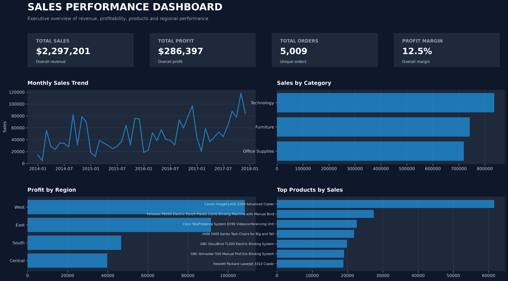
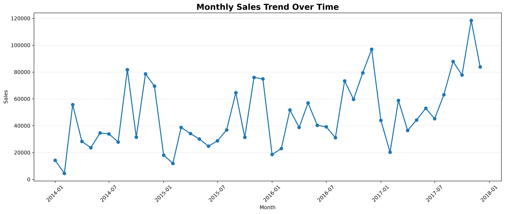
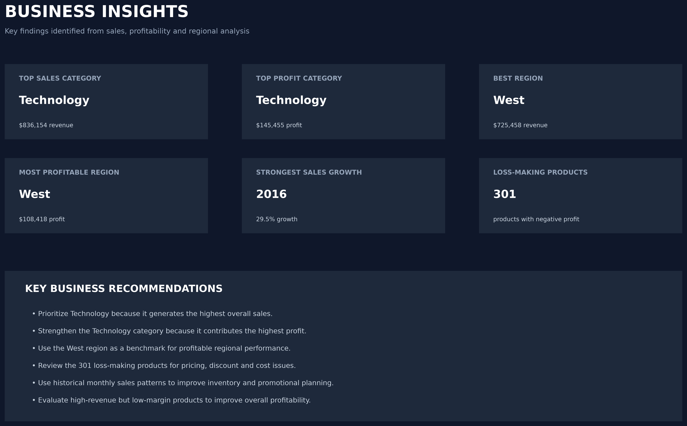

# Business Sales Performance Analysis

### Future Interns — Data Science & Analytics Internship

### Task 1

---

## 1. Executive Summary

This project analyzes historical Superstore sales data to evaluate revenue performance, profitability, product performance, category performance, regional performance, and sales trends over time.

The analysis follows an end-to-end data analytics workflow, beginning with raw transactional data preparation and continuing through exploratory analysis, KPI calculation, profitability analysis, visualization, and business recommendation generation.

The primary objective is to identify the areas contributing most strongly to business performance and highlight opportunities for improving profitability and sustainable growth.

---

## 2. Business Objectives

The analysis was designed to answer the following business questions:

* Which products generate the highest revenue?
* Which products generate the highest profit?
* Which categories perform best?
* Which regions generate the strongest sales?
* Which regions generate the strongest profit?
* How do sales change over time?
* Which products are loss-making?
* Where should the business focus its growth efforts?
* What actions could improve profitability?

---

## 3. Dataset Overview

The project uses the Superstore transactional sales dataset.

The dataset contains information relating to:

* Orders
* Customers
* Products
* Product categories
* Geographic regions
* Sales
* Quantity
* Discounts
* Profit
* Order dates
* Shipping information

The dataset was used for analytical and educational purposes as part of the internship project.

---

## 4. Methodology

The analysis followed these major stages:

### Step 1 — Data Loading

The raw Superstore CSV file was loaded into Python using Pandas.

### Step 2 — Data Inspection

The dataset was inspected for:

* Dataset dimensions
* Column names
* Data types
* Missing values
* Duplicate records

### Step 3 — Data Cleaning

Date fields were converted into appropriate datetime formats and the dataset was checked for missing and duplicate records.

### Step 4 — Feature Engineering

Additional analytical fields were created, including:

* Order Year
* Order Month
* Order Month Name
* Quarter
* Profit Margin

### Step 5 — Exploratory Analysis

Sales and profit were analyzed across:

* Products
* Categories
* Regions
* States
* Years
* Months

### Step 6 — KPI Analysis

The following business KPIs were calculated:

* Total Sales
* Total Profit
* Total Orders
* Total Quantity
* Average Order Value
* Profit Margin

### Step 7 — Business Insight Generation

The analysis identified the strongest and weakest performing areas and converted the results into actionable recommendations.

---

## 5. Executive KPIs

The project calculates the following core performance indicators:

| KPI                 | Description                     |
| ------------------- | ------------------------------- |
| Total Sales         | Overall revenue generated       |
| Total Profit        | Overall profit generated        |
| Total Orders        | Number of unique orders         |
| Total Quantity      | Total units sold                |
| Average Order Value | Average revenue per order       |
| Profit Margin       | Profit as a percentage of sales |

These KPIs provide a high-level view of the organization's overall sales performance.

---

## 6. Executive Dashboard

The executive dashboard provides a consolidated view of:

* Revenue
* Profit
* Orders
* Profit margin
* Monthly sales trends
* Category sales
* Regional profitability
* Top-performing products

---

## 7. Product Performance

Product-level analysis was performed to identify the products contributing the greatest amount of sales and profit.

The analysis also identified products generating negative total profit.

This distinction is important because high sales volume does not necessarily indicate strong financial performance.

A product may generate substantial revenue while producing limited or negative profit due to:

* High discount levels
* Pricing strategy
* Product costs
* Shipping costs
* Operational expenses

---

## 8. Category Performance

Categories were compared using both revenue and profitability.

The analysis evaluates:

* Total sales by category
* Total profit by category
* Profit margin by category

This provides a more complete view than ranking categories by sales alone.

A category with high revenue but relatively low profitability may require different management attention from a category with lower revenue but stronger margins.

---

## 9. Regional Performance

Regional performance was analyzed using sales, profit, and profit margin.

The analysis helps identify:

* High-revenue regions
* High-profit regions
* Low-profit regions
* Regional profitability opportunities

Regional performance can support decisions related to marketing investment, sales expansion, customer acquisition, and resource allocation.

---

## 10. Time-Based Analysis

Sales performance was analyzed across both yearly and monthly periods.

The chronological monthly analysis provides visibility into changes in sales over time, while yearly analysis highlights broader growth patterns.

Time-based analysis can support:

* Inventory planning
* Promotional planning
* Seasonal campaign planning
* Resource allocation
* Demand forecasting

---

## 11. Business Insights

The analysis identifies several important performance dimensions:

### Revenue Performance

The highest-performing categories and products represent important revenue drivers and should receive appropriate inventory and marketing support.

### Profitability

Profitability should be evaluated alongside revenue because strong sales do not always translate into strong financial returns.

### Regional Opportunity

High-performing regions provide potential opportunities for further expansion, while weaker regions should be reviewed for pricing, demand, product mix, and operational factors.

### Loss-Making Products

Products generating negative total profit should be reviewed to determine whether discounting, pricing, fulfillment, or product costs are affecting profitability.

### Growth

Year-over-year analysis provides insight into periods of stronger sales and profit growth and can help identify successful commercial patterns.

---

## 12. Business Recommendations

### Recommendation 1 — Prioritize High-Performing Products

Ensure adequate inventory and marketing support for products that consistently generate strong sales and profitability.

### Recommendation 2 — Review Loss-Making Products

Investigate products with negative profitability and evaluate their pricing, discounts, costs, and fulfillment economics.

### Recommendation 3 — Optimize Discounts

Products with strong sales but weak margins should be reviewed for excessive discounting and pricing inefficiencies.

### Recommendation 4 — Focus on Profitable Regions

Growth investments should prioritize regions demonstrating both strong demand and healthy profitability.

### Recommendation 5 — Improve Inventory Planning

Historical monthly trends should be incorporated into inventory planning and promotional scheduling.

### Recommendation 6 — Monitor Profitability Alongside Revenue

Business performance should not be evaluated using sales alone. Revenue, profit, and margin should be monitored together.

---

## 13. Business Insights Visual

The insights page summarizes the most important findings and translates analytical results into business-oriented recommendations.

---

## 14. Conclusion

This project demonstrates an end-to-end Data Science and Analytics workflow for transforming raw transactional data into meaningful business insights.

The analysis combines data cleaning, feature engineering, exploratory data analysis, KPI analysis, product analysis, category analysis, regional analysis, time-series analysis, profitability analysis, visualization, and recommendation generation.

The resulting dashboard and business insights provide a concise view of organizational performance while highlighting areas where management can focus on revenue growth, profitability improvement, and more effective resource allocation.

---

## 15. Tools Used

* Python
* Pandas
* NumPy
* Matplotlib
* Seaborn
* Jupyter Notebook
* CSV

---

## 16. Project Deliverables

The completed project contains:

* Cleaned dataset
* Analytical datasets
* Jupyter analysis notebook
* Executive dashboard
* Business insights page
* Data visualizations
* Business recommendations
* Final analysis report
* GitHub-ready project structure

---

## 17. Author

**Chitra Saravanan**

MCA — VIT Vellore

Data Science & Analytics | Python | SQL | Data Visualization | Machine Learning
